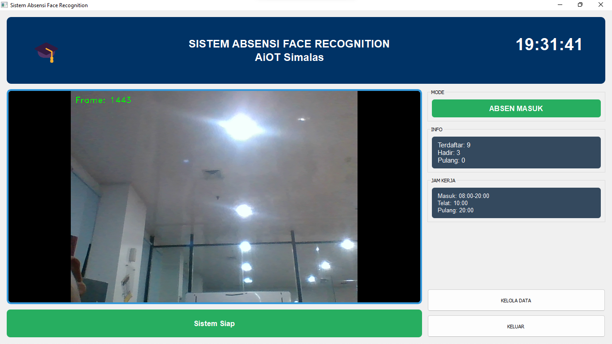
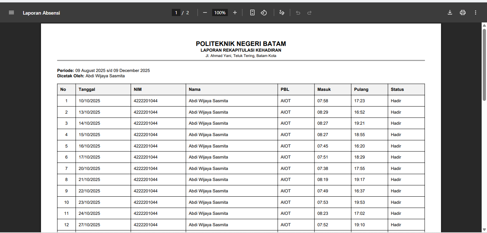
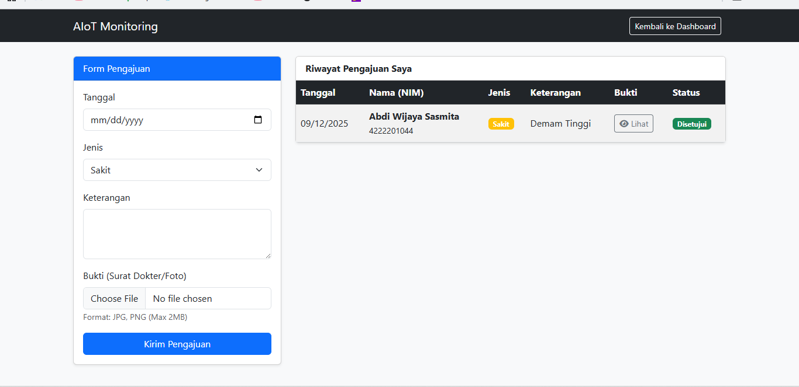

# 📸 AIoT Smart Attendance System (Face Recognition)


Sistem absensi cerdas yang mengintegrasikan **Computer Vision (IoT)** dengan **Web Monitoring System**. Proyek ini dirancang untuk memantau kehadiran mahasiswa secara *real-time*, transparan, dan akurat menggunakan teknologi pengenalan wajah.

Sistem terdiri dari dua komponen utama:
1.  **AI Engine (Python):** Mendeteksi wajah, memvalidasi identitas, dan mengirimkan bukti foto.
2.  **Web Dashboard (Laravel Livewire):** Memantau kehadiran secara live tanpa reload, manajemen izin, dan pelaporan otomatis.

---

## 🚀 Fitur Unggulan

### 🖥️ Web Dashboard (Laravel)
-   **Real-time Monitoring:** Data kehadiran muncul otomatis di layar admin dalam hitungan detik (menggunakan *Livewire Polling*).
-   **Evidence Based:** Menampilkan bukti foto wajah yang diambil saat absensi dilakukan.
-   **Smart Filtering:** Filter data berdasarkan Tanggal, Tim (PBL), dan Angkatan.
-   **Administration:** Manajemen perizinan (Sakit/Izin) dengan fitur upload surat dokter dan approval Admin.
-   **Reporting:**
    -   Export Data ke **Excel**.
    -   Cetak Laporan Resmi ke **PDF** (dengan Kop Surat & Tanda Tangan).
-   **Visual Statistics:** Grafik Pie Chart dan Bar Chart interaktif untuk analisis kehadiran.

### 📷 AI & Hardware (Python)
-   **High Accuracy:** Menggunakan library **InsightFace** untuk pengenalan wajah yang presisi.
-   **Anti-Spoofing Logic:** Logika validasi untuk mencegah kecurangan sederhana.
-   **Auto Capture:** Otomatis mengambil foto wajah saat terdeteksi dan menyimpannya ke server.
-   **Interactive GUI:** Antarmuka berbasis **PyQt5** yang menampilkan video feed dan status absensi.

---

## 🛠️ Teknologi yang Digunakan

| Kategori | Teknologi |
| :--- | :--- |
| **Backend Framework** | Laravel 12 (PHP 8.4) |
| **Frontend** | Laravel Livewire 3, Bootstrap 5, Chart.js |
| **Database** | MySQL / MariaDB |
| **AI / Computer Vision** | Python 3, OpenCV, InsightFace, NumPy |
| **Desktop GUI** | PyQt5 |
| **Reporting** | Maatwebsite Excel, DomPDF |

---

## 📸 Screenshots

*(Simpan screenshot aplikasi Anda di folder public/screenshots lalu link ke sini)*

| Dashboard Monitoring | AI Face Recognition |
| :---: | :---: |
|  |  |

| Laporan PDF | Fitur Izin |
| :---: | :---: |
|  |  |

---

## ⚙️ Instalasi & Cara Menjalankan

### 1. Setup Web (Laravel)

1.  **Clone Repository**
    ```bash
    git clone https://github.com/AbdiWijaya02/Monitoring-Absensi-Berbasis-Laravel
    cd Monitoring-Absensi-Berbasis-Laravel
    ```

2.  **Install Dependencies**
    ```bash
    composer install
    ```

3.  **Konfigurasi Environment**
    -   Copy file `.env.example` menjadi `.env`.
    -   Atur koneksi database di `.env`:
        ```env
        DB_DATABASE=aiot
        DB_USERNAME=root
        DB_PASSWORD=
        ```

4.  **Setup Database & Storage**
    ```bash
    php artisan migrate
    php artisan storage:link  # Wajib agar foto bisa tampil
    ```

5.  **Jalankan Server**
    ```bash
    php artisan serve
    ```

### 2. Setup AI Engine (Python)

1.  Pastikan Python 3.x terinstall.
2.  Install library yang dibutuhkan:
    ```bash
    pip install opencv-python numpy insightface onnxruntime PyQt5 mysql-connector-python
    ```
3.  **Konfigurasi Path Foto:**
    -   Buka file script python.
    -   Ubah variabel `LARAVEL_STORAGE_PATH` agar mengarah ke folder `storage/app/public/kehadiran` di proyek Laravel Anda.
4.  Jalankan Aplikasi:
    ```bash
    python absensi_app.py
    ```

---

## 🔄 Alur Kerja Sistem

1.  **Registrasi:** Admin mendaftarkan wajah mahasiswa melalui aplikasi Python (mengambil 5 sampel foto wajah).
2.  **Absensi:** Mahasiswa menghadapkan wajah ke kamera.
3.  **Proses:**
    -   Python mengenali wajah -> Simpan Foto ke folder -> Kirim Data ke MySQL.
4.  **Monitoring:**
    -   Admin melihat dashboard web.
    -   Data dan Foto muncul secara otomatis (Auto-refresh).
5.  **Laporan:** Admin mengunduh rekap kehadiran dalam bentuk PDF/Excel di akhir bulan.

---
⭐ *Jika proyek ini bermanfaat atau menarik, jangan lupa berikan Star di GitHub!*